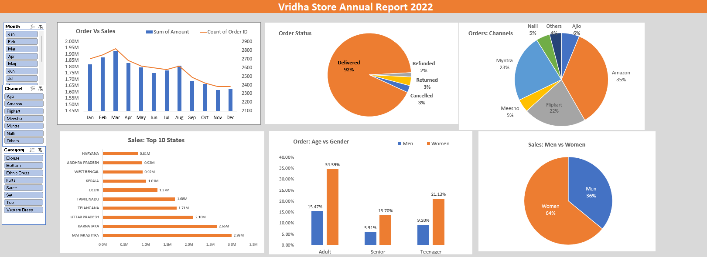

# Vrinda Store Annual Sales Report (2022)

## Project Description

This repository hosts an interactive dashboard created using Excel, encompassing data cleaning, processing, analysis, visualization, and reporting functionalities. Insights derived from the analysis have been shared with clients to aid in strategic decision-making.

## Objective

Vrinda Store aimed to create an annual sales report for 2022 to gain insights into customer behavior and enhance sales growth strategies for 2023.

## Dashboard Screenshot

## Questions Investigated

1. **Sales vs. Orders Comparison:** Display the correlation between sales and orders using a single chart.
2. **Highest Sales and Orders Month:** Identify the month with the highest sales and orders.
3. **Gender Analysis:** Determine whether men or women made more purchases in 2022.
4. **Order Status:** List the different order statuses observed in 2022.
5. **Top Contributing States:** Identify the top 10 states contributing to sales.
6. **Age and Gender Relationship:** Explore the relationship between age and gender based on the number of orders.
7. **Sales Channels:** Determine the sales channel contributing the most to overall sales.
8. **Highest Selling Category:** Identify the highest selling category of products.

## Insights

- Women accounted for 65% of total sales, indicating a significant market opportunity.
- The top three contributing states were Maharashtra, Karnataka, and Uttar Pradesh, collectively representing 35% of total sales.
- The adult age group (30-49 years) contributed the most to purchases, making up 50% of total orders.
- Amazon, Flipkart, and Myntra emerged as the primary sales channels, contributing 80% of total sales.

## Final Conclusion

In 2022, Vrinda Store observed a dominance of women in driving sales, with Maharashtra, Karnataka, and Uttar Pradesh emerging as key contributors. The 30-49 age group constituted the majority of purchases, while Amazon, Flipkart, and Myntra were the primary sales channels. Moving forward, targeted marketing towards women and strategic focus on top states and preferred
